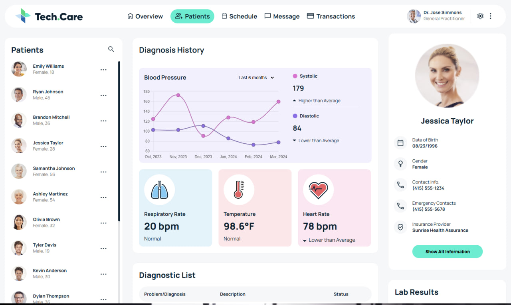

# Job Application Layout

This repository contains the HTML and CSS code for a webpage layout created as part of a job application. The layout was developed based on a provided design mockup, showcasing my front-end skills in responsive and pixel-perfect web design.

## 🖼 Preview

In the repository, you can find a preview image of the final version of the layout as rendered in the browser. The image file is named `final-layout-preview.jpg`. This preview demonstrates the finished look and feel of the layout.

> **Note**: The preview image is a screenshot of the webpage in a completed state.

## 📁 Project Structure

- **index.html** — main HTML file for the webpage.
- **styles.css** — contains all CSS styles for the layout, following best practices and organized by section.
- **script** — script file for show the graph.
- **imgs** — folder for images, icons, and other assets used in the layout.

## 📐 Key Features

- **Pixel-Perfect Layout**: Matches the original design mockup with attention to detail.
- **Modern CSS**: Uses Flexbox and CSS Grid for efficient, clean, and responsive layout management.
